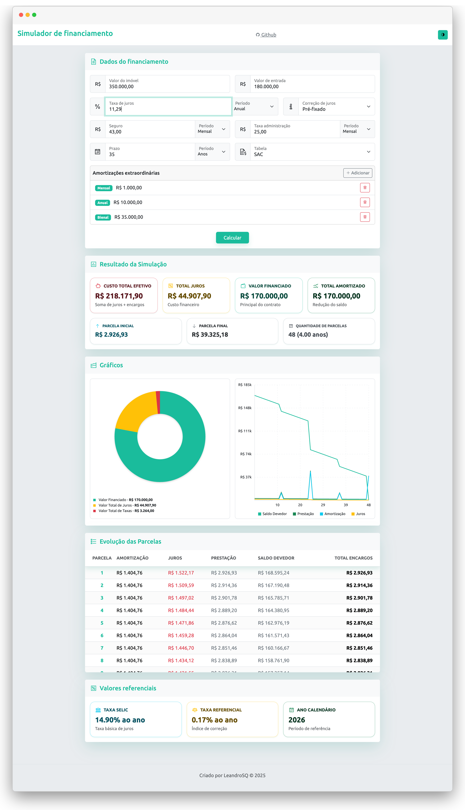
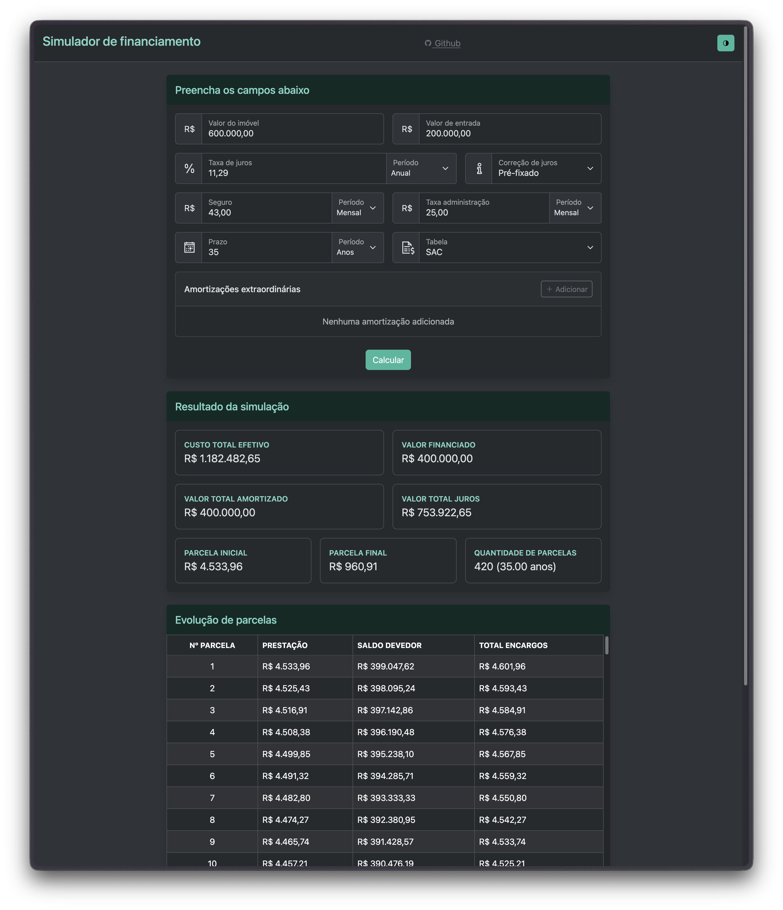

# Simulador de Financiamento Imobiliário (Brasil)

Web app em TypeScript sem frameworks para simular financiamento imobiliário no Brasil, com foco em transparência e cronograma de amortização claro.

- Português: este arquivo
- English: see [README.md](README.md)

    

		
        
    

	<a href="https://leandrosq.github.io/js-simulador-financiamento-imobiliario/">Demo</a>

## Sobre

Este simulador gera um cronograma de amortização mês a mês para que você veja quanto cada parcela é juros e quanto é principal, além de como pagamentos extraordinários reduzem o custo total e o prazo.

Durante o desenvolvimento, os cálculos foram validados com exemplos reais para manter resultados consistentes com a prática.

Escopo atual: simulações com taxa fixa usando SAC.

## Recursos

- [x] SAC (Sistema de Amortização Constante)
- [x] Taxa de juros fixa
- [x] Pagamentos extraordinários (mensais, anuais, semestrais e personalizados)
- [x] Validação de entradas
- [x] Design responsivo
- [x] Modo claro e escuro
- [x] Testes unitários
- [ ] PRICE (sistema francês)
- [ ] Taxa de juros variável
- [ ] Gráficos
- [ ] Exportação para PDF/CSV

## Tecnologias

- TypeScript
- Web Worker para cálculos pesados
- Templates EJS
- SCSS + Bootstrap
- Gulp + esbuild
- Jest

## Como começar

### Requisitos

- Node.js (LTS recente)
- pnpm (recomendado) ou npm

### Instalação

`pnpm install`

### Rodar localmente

- Dev (watch + BrowserSync): `pnpm dev`
- Execução local em modo produção: `pnpm start`

Depois, abra `http://localhost:3000`.

### Build

`pnpm build`

A saída vai para `dist/`.

### Lint

`pnpm lint`

### Testes

`pnpm test`

## Estrutura do projeto (visão geral)

- `src/scripts/core/` lógica de financiamento
- `src/scripts/services/` provedores de taxa (ex.: SELIC, TR)
- `src/scripts/worker/` entrada do worker + bindings
- `src/views/` templates EJS
- `src/styles/` SCSS
- `tests/` testes unitários

## Contribuindo

Issues e PRs são bem-vindos, especialmente para PRICE, taxas variáveis, gráficos e exportação.

## Licença

MIT. Veja [LICENSE](LICENSE).
